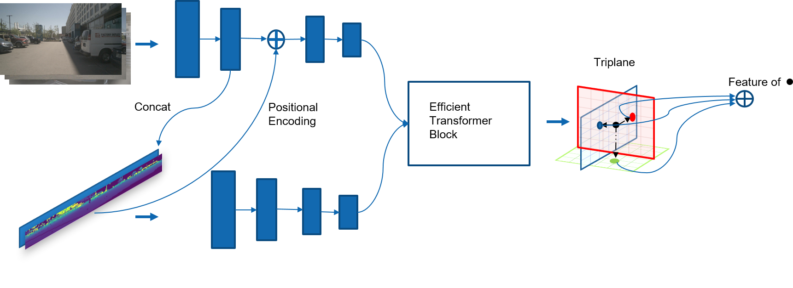
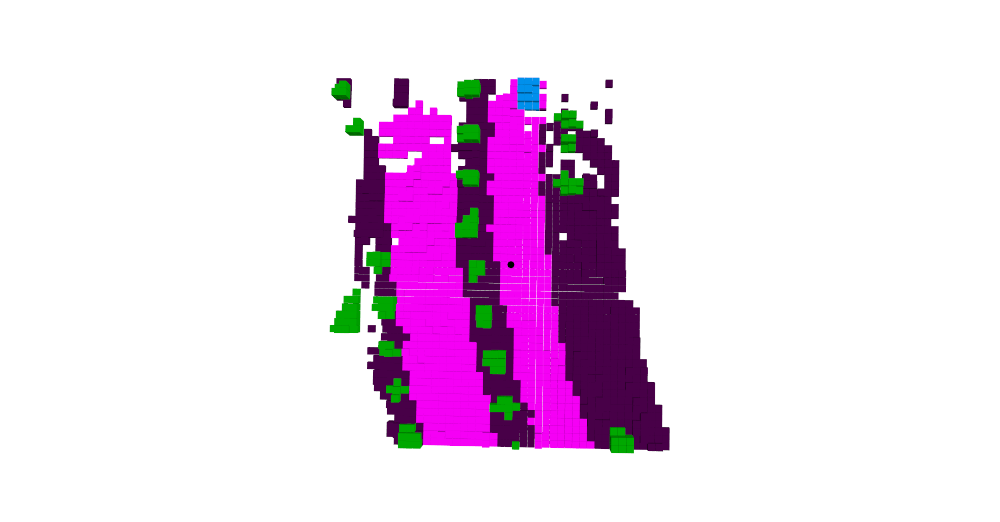
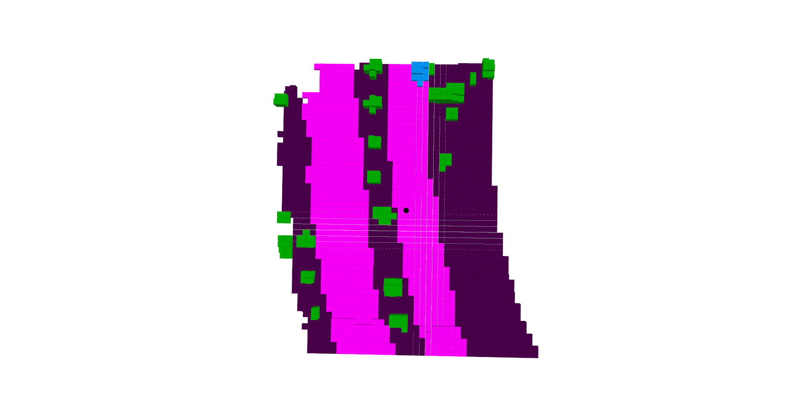

# Efficient Multi-Modal Environment Representation for Robot Navigation.


This is the implementation of Sapar Charyyev's thesis titled - Efficient Multi-Modal Environment Representation for Robot Navigation.
 


## Results

<!--         -->
<table>
  <tr>
    <td align="center">
      <p>Ground Truth</p>
      
    </td>
    <td align="center">
      <p>Ours</p>
      
    </td>
  </tr>
</table>

### 3D Semantic Occupancy Prediction (on nuScenes validation)

|        Model         | Modality | IoU  | mIoU  | Vehicle | Drivable surface |	Other surface |	Vegetation |
| :------------------: | :------: | :--: | :--:  |  :--:   |   :--:           | :--:          | :--:       |
| [SurroundOcc](https://github.com/weiyithu/SurroundOcc) | C | 0.373|	0.375|	0.380|	0.462|	0.368|	0.291
| [OCCFusion](https://github.com/DanielMing123/OccFusion) | C+L | 0.522|	0.473|	0.454|	0.506|	0.426|	0.507|
| Ours | C+L | 0.488|	0.424|	0.384|	0.543|	0.445|	0.324|


## Prerequisites

- Python == 3.8
- [mmcv-full](https://github.com/open-mmlab/mmcv) == 1.4.0
- [mmdetection](http://github.com/open-mmlab/mmdetection) = 2.14.0
- [torch](https://github.com/pytorch/pytorch) == 1.9.1+cu111
- [torchvision](https://github.com/pytorch/pytorch) == 0.10.1+cu111
- numpy == 1.19.5
- matplotlib == 3.6.2
- pyquaternion == 0.9.9
- scikit-learn == 1.1.3
- setuptools == 59.5.0
- Pytorch-geometric == 2.1.0
- spconv == 2.1.21
- torchsparse == 1.4.0
- segment-anything

After installing these dependencies, please run this command to install the codebase:

```bash
python setup.py develop
```


## Data Preparation

We follow the instructions from [here](https://github.com/open-mmlab/mmdetection3d/blob/master/docs/en/datasets/nuscenes_det.md) to download the nuScenes dataset. 

After downloading the nuScenes dataset, please preprocess the nuScenes dataset by:

```bash
python tools/create_data.py nuscenes --root-path ./data/nuscenes --out-dir ./data/nuscenes --extra-tag nuscenes
```

Create range images and save for convenience:

```bash
python tools/create_range_images.py --dataroot "data root" --save_path "save path" 
```

Create point clusters using SAM:
```bash
python sam/create_sam_masks.py --data_root "data root" --save_path "save_path" --ann_file "annotation file"
```

## Pre-training

### Training

Train by running:

```bash
python -u tools/train.py configs/triplane_surf_sam.py --work-dir "checkpoint save dir" --data-root "data root"
                                 
```

To train on euler run:

```bash
sbatch tools/euler_train.sh
```


### Visualization

To get the reconstruction results of the images and the LiDAR point cloud, please run:

```bash
python tools/test.py configs/triplane_surf_sam.py --checkpoint "checkpoint path" --show-pretrain --show-dir "save location" --data-root "data root" 
```


## Fine-tuning

### Training

Train by running:

```bash
python -u tools/train.py configs/triplane_occ.py --work-dir "checkpoint save dir" --data-root "data root"
                                 
```

To train on euler run:

```bash
sbatch tools/euler_train.sh
```


### Visualization

To get the reconstruction results of the images and the LiDAR point cloud, please run:

```bash
python tools/test.py configs/triplane_occ.py --checkpoint "checkpoint path" --show-pretrain --show-dir "save location" --data-root "data root" 
```


## Acknowledgement
Our code is based on [mmdetection3d](https://github.com/open-mmlab/mmdetection3d). This repository is also inspired by the following outstanding contributions to the open-source community: [Unim2AE](https://github.com/hollow-503/UniM2AE)
